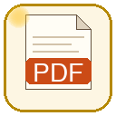
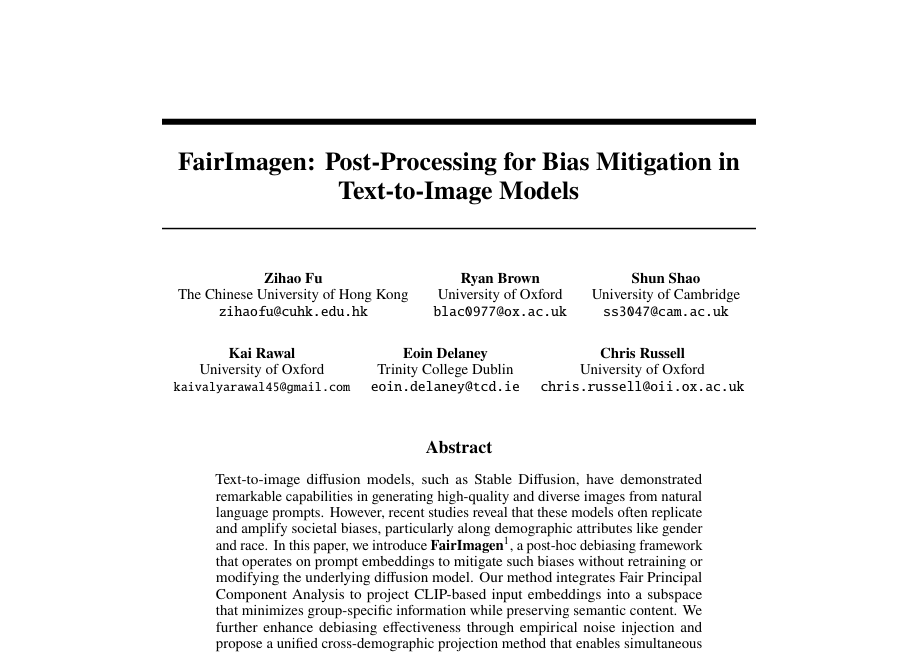
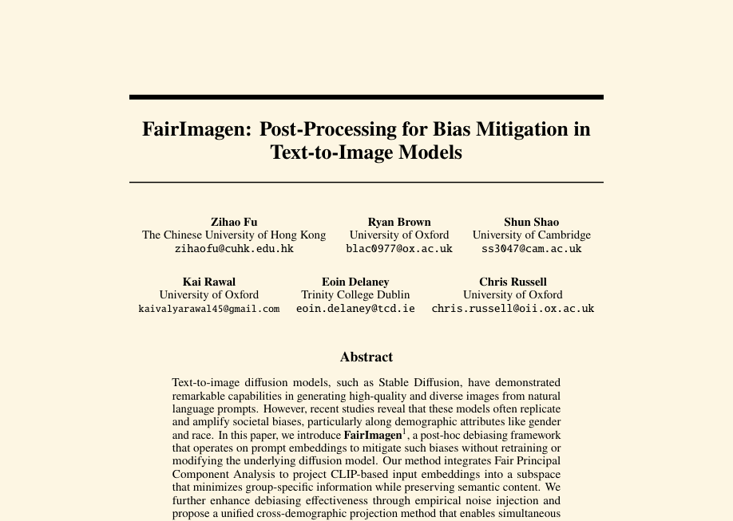
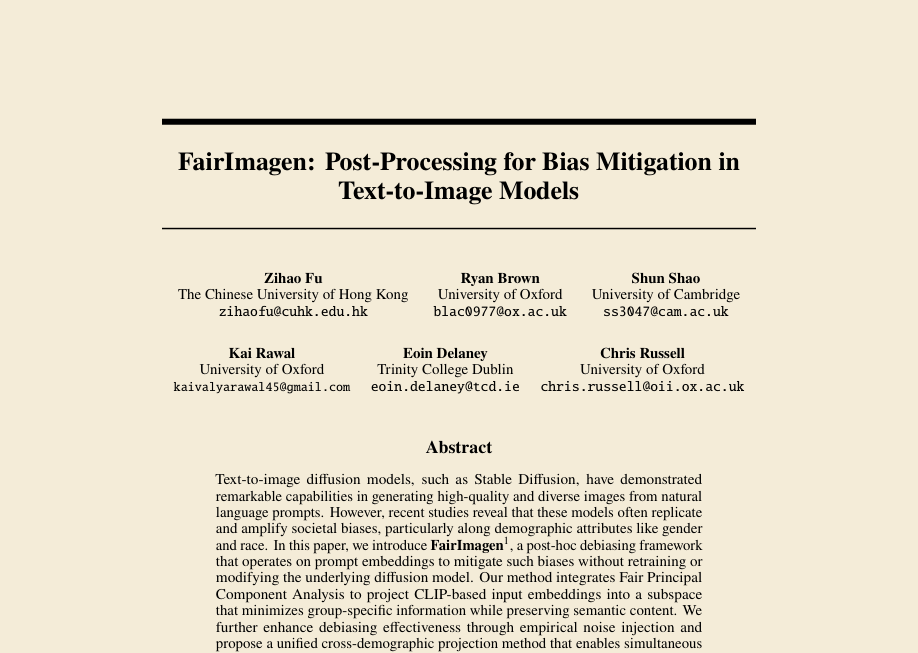
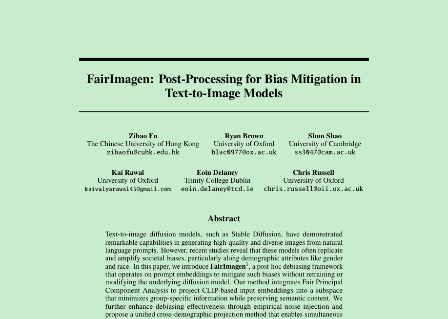
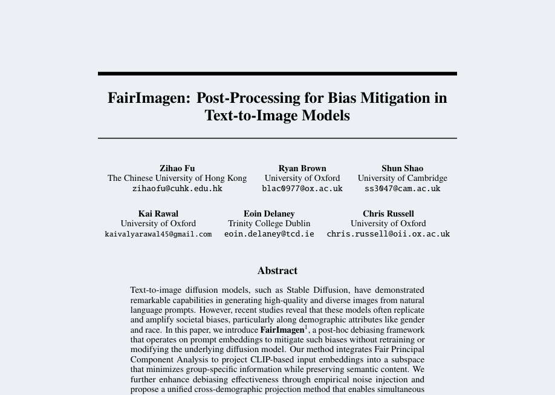
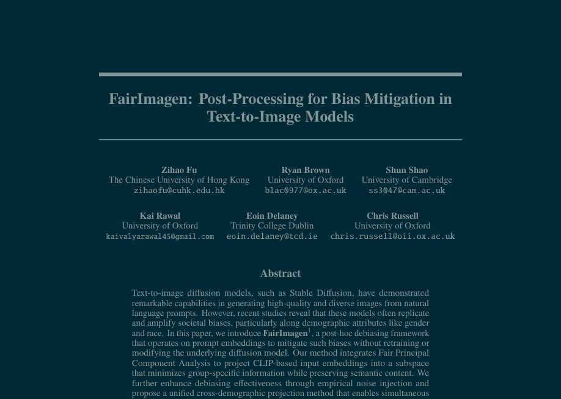
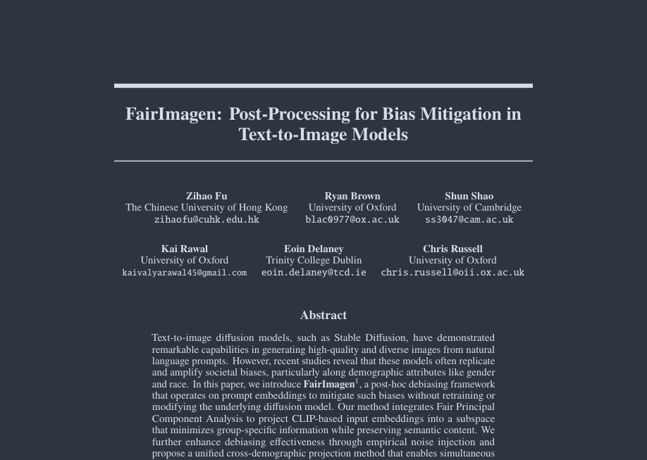
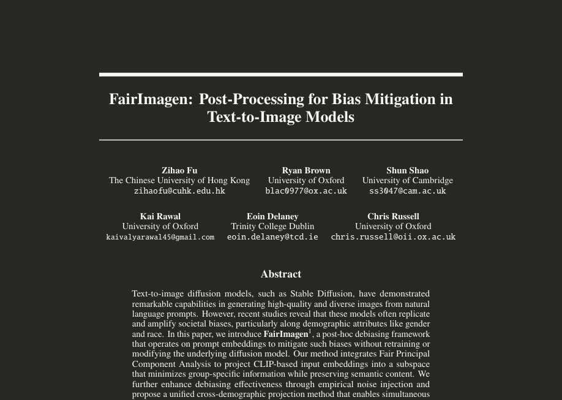
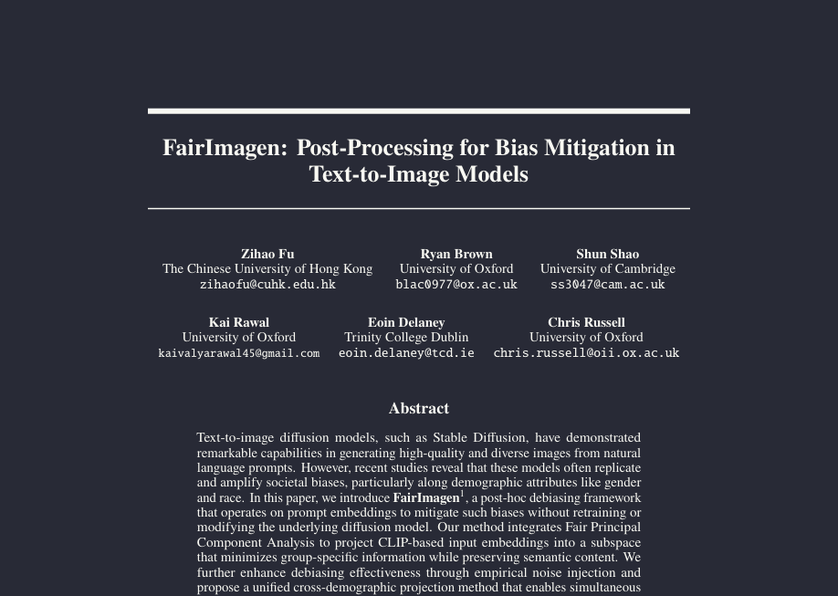

# Cozy PDF Viewer

A VS Code extension for viewing PDFs with built-in eye-protection color themes. Reduce eye strain with warm, cool, or dark color schemes — no extra configuration needed.



## Features

- **9 built-in color schemes** optimized for comfortable reading
- **Automatic light/dark mode** — colors adapt based on theme brightness
- **Custom colors** — define your own foreground and background
- **Live preview** — color changes apply instantly without reopening the file
- **Full PDF viewer** — zoom, search, thumbnails, outline, rotation, and more

## Color Schemes

### Light Themes

| Disabled (Original) | Solarized Light | Sepia |
|:---:|:---:|:---:|
|  |  |  |

| Green Eye Care | Nord Light |
|:---:|:---:|
|  |  |

### Dark Themes

| Solarized Dark | Nord Dark |
|:---:|:---:|
|  |  |

| Monokai | Dracula |
|:---:|:---:|
|  |  |

You can also set `colorScheme` to `custom` and define your own foreground/background colors.

## Installation

### From Marketplace

Search for **Cozy PDF Viewer** in VS Code Extensions (`Ctrl+Shift+X` / `Cmd+Shift+X`).

### From VSIX

```bash
code --install-extension cozy-pdf-viewer-0.1.0.vsix
```

## Usage

1. Open any `.pdf` file in VS Code
2. Go to **Settings** → search `cozyPdfViewer`
3. Choose a color scheme from the dropdown

### Settings

| Setting | Default | Description |
|---------|---------|-------------|
| `cozyPdfViewer.colorScheme` | `disabled` | Color scheme for PDF pages |
| `cozyPdfViewer.customColors.background` | `#FDF6E3` | Custom background (when scheme is `custom`) |
| `cozyPdfViewer.customColors.foreground` | `#000000` | Custom text color (when scheme is `custom`) |

### Set as Default PDF Viewer

Add to your `settings.json`:

```json
{
  "workbench.editorAssociations": {
    "*.pdf": "cozyPdfViewer.preview"
  }
}
```

## How It Works

Cozy PDF Viewer uses SVG `feComponentTransfer` filters applied to the PDF canvas:

- **Light themes**: Multiply blend — black text stays black, white pages become the target background color
- **Dark themes**: Linear remap — maps black→foreground and white→background, inverting the page while preserving color relationships

This approach works at the pixel level without modifying the PDF content, so text selection, search, and printing remain unaffected.

## License

MIT
